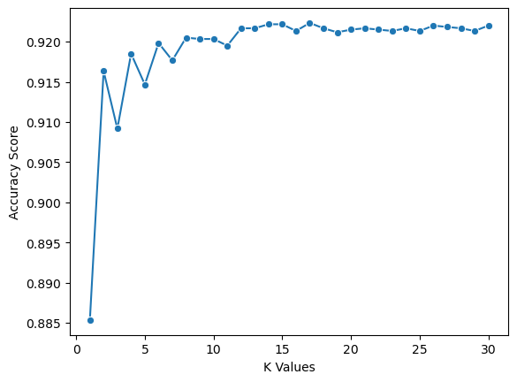

# Analysis on Acute Liver Failure using Apache Hadoop
## Submitted By

- G. Yogeshwar | 19MIS1151
- S Jeevana	| 19MIS1169
- Rihana Zainab | 19MIS1167
 

## 1. Data Cleaning 


```python
import pandas as pd
import numpy as np
import statsmodels.api as sapi
from statsmodels.formula.api import ols
import matplotlib.pyplot as plt
```


```python
df = pd.read_csv('data.csv')
```


```python
print(df.head)
```

    <bound method NDFrame.head of       Age Gender Region  Weight  Height  Body Mass Index  Obesity  Waist  \
    0      65      M   east    56.0   162.1            21.31      0.0   83.6   
    1      36      M  south    60.2   162.2            22.88      0.0   76.6   
    2      66      M   east    83.9   162.5            31.77      1.0  113.2   
    3      54      M   east    69.4   160.5            26.94      0.0   77.9   
    4      63      M  north    73.1   159.2            28.84      0.0   89.3   
    ...   ...    ...    ...     ...     ...              ...      ...    ...   
    8780   35      F   east    70.0   171.5            23.80      0.0   87.5   
    8781   66      F  north   102.0   180.7            31.24      1.0  113.2   
    8782   37      F  south    84.4   186.0            24.40      0.0   93.6   
    8783   39      F   east    92.1   184.8            26.97      0.0   98.2   
    8784   70      M   east    58.5   161.1            22.54      0.0   99.4   
    
          Maximum Blood Pressure  Minimum Blood Pressure  ...  PoorVision  \
    0                      135.0                    71.0  ...         0.0   
    1                       96.0                    52.0  ...         0.0   
    2                      115.0                    57.0  ...         0.0   
    3                      110.0                    57.0  ...         0.0   
    4                      132.0                    73.0  ...         0.0   
    ...                      ...                     ...  ...         ...   
    8780                   114.0                    76.0  ...         0.0   
    8781                   117.0                    72.0  ...         0.0   
    8782                   144.0                    82.0  ...         0.0   
    8783                   121.0                    75.0  ...         0.0   
    8784                   125.0                    82.0  ...         NaN   
    
          Alcohol Consumption  HyperTension  Family  HyperTension  Diabetes  \
    0                       1           0.0                     0       0.0   
    1                       0           0.0                     0       0.0   
    2                       1           0.0                     0       1.0   
    3                       1           0.0                     0       0.0   
    4                       0           1.0                     0       0.0   
    ...                   ...           ...                   ...       ...   
    8780                    1           0.0                     1       0.0   
    8781                    0           1.0                     0       0.0   
    8782                    0           1.0                     0       0.0   
    8783                    0           0.0                     0       0.0   
    8784                    0           1.0                     1       0.0   
    
          Family Diabetes  Hepatitis  Family Hepatitis  Chronic Fatigue  ALF  
    0                   1        1.0               0.0              0.0  0.0  
    1                   0        0.0               0.0              0.0  0.0  
    2                   0        0.0               0.0              0.0  0.0  
    3                   0        0.0               0.0              0.0  0.0  
    4                   0        0.0               0.0              0.0  0.0  
    ...               ...        ...               ...              ...  ...  
    8780                1        0.0               0.0              0.0  NaN  
    8781                1        0.0               0.0              0.0  NaN  
    8782                0        0.0               0.0              0.0  NaN  
    8783                0        0.0               0.0              0.0  NaN  
    8784                0        0.0               0.0              0.0  NaN  
    
    [8785 rows x 30 columns]>


```python
df = df.dropna(axis = 0, subset=['ALF'])
df = df.drop(['Region'], axis=1)

```


```python
df.drop(['Source of Care'], axis=1)
```


```python
df = df.replace(to_replace="M", value=0)

```


```python
df = df.replace(to_replace="F", value=1)

```


```python
print(df.info)
```

    <bound method DataFrame.info of       Age  Gender  Weight  Height  Body Mass Index  Obesity  Waist  \
    0      65       0    56.0   162.1            21.31      0.0   83.6   
    1      36       0    60.2   162.2            22.88      0.0   76.6   
    2      66       0    83.9   162.5            31.77      1.0  113.2   
    3      54       0    69.4   160.5            26.94      0.0   77.9   
    4      63       0    73.1   159.2            28.84      0.0   89.3   
    ...   ...     ...     ...     ...              ...      ...    ...   
    5995   77       1   109.3   185.8            31.66      1.0  117.2   
    5996   49       1    86.6   168.9            30.36      1.0   99.5   
    5997   30       1    78.0   174.9            25.50      0.0   89.2   
    5998   75       1    78.8   176.5            25.30      0.0  100.4   
    5999   35       0    62.3   164.2            23.11      0.0   87.2   
    
          Maximum Blood Pressure  Minimum Blood Pressure  Good Cholesterol  ...  \
    0                      135.0                    71.0              48.0  ...   
    1                       96.0                    52.0              31.0  ...   
    2                      115.0                    57.0              44.0  ...   
    3                      110.0                    57.0              74.0  ...   
    4                      132.0                    73.0              67.0  ...   
    ...                      ...                     ...               ...  ...   
    5995                   149.0                    77.0              33.0  ...   
    5996                   130.0                    75.0              38.0  ...   
    5997                   126.0                    83.0              40.0  ...   
    5998                   129.0                    50.0              58.0  ...   
    5999                    95.0                    59.0              52.0  ...   
    
          PoorVision  Alcohol Consumption  HyperTension  Family  HyperTension  \
    0            0.0                    1           0.0                     0   
    1            0.0                    0           0.0                     0   
    2            0.0                    1           0.0                     0   
    3            0.0                    1           0.0                     0   
    4            0.0                    0           1.0                     0   
    ...          ...                  ...           ...                   ...   
    5995         0.0                    1           1.0                     0   
    5996         0.0                    0           1.0                     1   
    5997         0.0                    0           0.0                     1   
    5998         0.0                    1           1.0                     0   
    5999         0.0                    1           0.0                     0   
    
          Diabetes  Family Diabetes  Hepatitis  Family Hepatitis  Chronic Fatigue  \
    0          0.0                1        1.0               0.0              0.0   
    1          0.0                0        0.0               0.0              0.0   
    2          1.0                0        0.0               0.0              0.0   
    3          0.0                0        0.0               0.0              0.0   
    4          0.0                0        0.0               0.0              0.0   
    ...        ...              ...        ...               ...              ...   
    5995       0.0                0        0.0               0.0              0.0   
    5996       0.0                0        0.0               0.0              0.0   
    5997       0.0                1        0.0               0.0              0.0   
    5998       1.0                1        0.0               0.0              0.0   
    5999       0.0                0        0.0               0.0              0.0   
    
          ALF  
    0     0.0  
    1     0.0  
    2     0.0  
    3     0.0  
    4     0.0  
    ...   ...  
    5995  1.0  
    5996  0.0  
    5997  0.0  
    5998  0.0  
    5999  0.0  
    
    [6000 rows x 28 columns]>


```python
df.isnull().sum()
```


    Age                         0
    Gender                      0
    Weight                    133
    Height                    139
    Body Mass Index           206
    Obesity                   206
    Waist                     215
    Maximum Blood Pressure    206
    Minimum Blood Pressure    252
    Good Cholesterol            8
    Bad Cholesterol             8
    Total Cholesterol           6
    Dyslipidemia                0
    PVD                         0
    Physical Activity           8
    Education                  15
    Unmarried                 301
    Income                    792
    PoorVision                376
    Alcohol Consumption         0
    HyperTension               53
    Family  HyperTension        0
    Diabetes                    1
    Family Diabetes             0
    Hepatitis                  13
    Family Hepatitis            3
    Chronic Fatigue            26
    ALF                         0
    dtype: int64


```python
df.columns
```


    Index(['Age', 'Gender', 'Weight', 'Height', 'Body Mass Index', 'Obesity',
           'Waist', 'Maximum Blood Pressure', 'Minimum Blood Pressure',
           'Good Cholesterol', 'Bad Cholesterol', 'Total Cholesterol',
           'Dyslipidemia', 'PVD', 'Physical Activity', 'Education', 'Unmarried',
           'Income', 'PoorVision', 'Alcohol Consumption', 'HyperTension',
           'Family  HyperTension', 'Diabetes', 'Family Diabetes', 'Hepatitis',
           'Family Hepatitis', 'Chronic Fatigue', 'ALF'],
          dtype='object')


## 2. Dataset Transformation & Featureset Selection


```python
from sklearn.impute import SimpleImputer
imp = SimpleImputer(strategy = 'median')

```


```python
imputer = imp.fit_transform(df)
```


```python
df = pd.DataFrame(imputer, columns = ['Age', 'Gender', 'Weight', 'Height', 'Body Mass Index', 'Obesity',
       'Waist', 'Maximum Blood Pressure', 'Minimum Blood Pressure',
       'Good Cholesterol', 'Bad Cholesterol', 'Total Cholesterol',
       'Dyslipidemia', 'PVD', 'Physical Activity', 'Education', 'Unmarried',
       'Income', 'PoorVision', 'Alcohol Consumption', 'HyperTension',
       'Family  HyperTension', 'Diabetes', 'Family Diabetes', 'Hepatitis',
       'Family Hepatitis', 'Chronic Fatigue', 'ALF'])
```


```python
df.info()
```

    <class 'pandas.core.frame.DataFrame'>
    RangeIndex: 6000 entries, 0 to 5999
    Data columns (total 28 columns):
     #   Column                  Non-Null Count  Dtype  
    ---  ------                  --------------  -----  
     0   Age                     6000 non-null   float64
     1   Gender                  6000 non-null   float64
     2   Weight                  6000 non-null   float64
     3   Height                  6000 non-null   float64
     4   Body Mass Index         6000 non-null   float64
     5   Obesity                 6000 non-null   float64
     6   Waist                   6000 non-null   float64
     7   Maximum Blood Pressure  6000 non-null   float64
     8   Minimum Blood Pressure  6000 non-null   float64
     9   Good Cholesterol        6000 non-null   float64
     10  Bad Cholesterol         6000 non-null   float64
     11  Total Cholesterol       6000 non-null   float64
     12  Dyslipidemia            6000 non-null   float64
     13  PVD                     6000 non-null   float64
     14  Physical Activity       6000 non-null   float64
     15  Education               6000 non-null   float64
     16  Unmarried               6000 non-null   float64
     17  Income                  6000 non-null   float64
     18  PoorVision              6000 non-null   float64
     19  Alcohol Consumption     6000 non-null   float64
     20  HyperTension            6000 non-null   float64
     21  Family  HyperTension    6000 non-null   float64
     22  Diabetes                6000 non-null   float64
     23  Family Diabetes         6000 non-null   float64
     24  Hepatitis               6000 non-null   float64
     25  Family Hepatitis        6000 non-null   float64
     26  Chronic Fatigue         6000 non-null   float64
     27  ALF                     6000 non-null   float64
    dtypes: float64(28)
    memory usage: 1.3 MB


```python
df.isnull().sum()
```


    Age                       0
    Gender                    0
    Weight                    0
    Height                    0
    Body Mass Index           0
    Obesity                   0
    Waist                     0
    Maximum Blood Pressure    0
    Minimum Blood Pressure    0
    Good Cholesterol          0
    Bad Cholesterol           0
    Total Cholesterol         0
    Dyslipidemia              0
    PVD                       0
    Physical Activity         0
    Education                 0
    Unmarried                 0
    Income                    0
    PoorVision                0
    Alcohol Consumption       0
    HyperTension              0
    Family  HyperTension      0
    Diabetes                  0
    Family Diabetes           0
    Hepatitis                 0
    Family Hepatitis          0
    Chronic Fatigue           0
    ALF                       0
    dtype: int64


```python
df.duplicated().sum()
```


    0


```python
df = df.drop(['Education'], axis=1)
```


```python
df = df.drop(['Unmarried'], axis=1)
```


```python
df = df.drop(['Income'], axis=1)
```


```python
df = df.drop(['PoorVision'], axis=1)
```


```python
df = df.drop(['Family  HyperTension'], axis=1)
```


```python
df = df.drop(['Family Diabetes'], axis=1)
```


```python
df = df.drop(['Family Hepatitis'], axis=1)
```


```python
df = df.drop(['Total Cholesterol'], axis=1)
```


```python
df = df.drop(['Body Mass Index'], axis=1)
```


```python
print(df.columns)
```

    Index(['Age', 'Gender', 'Weight', 'Height', 'Obesity', 'Waist',
           'Maximum Blood Pressure', 'Minimum Blood Pressure', 'Good Cholesterol',
           'Bad Cholesterol', 'Dyslipidemia', 'PVD', 'Physical Activity',
           'Alcohol Consumption', 'HyperTension', 'Diabetes', 'Hepatitis',
           'Chronic Fatigue', 'ALF'],
          dtype='object')


```python
correlation_matrix = df.corr()
print(correlation_matrix)
```

                                 Age    Gender    Weight    Height   Obesity  \
    Age                     1.000000  0.036107 -0.050409 -0.142165 -0.010784   
    Gender                  0.036107  1.000000  0.262554  0.658381 -0.093773   
    Weight                 -0.050409  0.262554  1.000000  0.456077  0.653691   
    Height                 -0.142165  0.658381  0.456077  1.000000 -0.054439   
    Obesity                -0.010784 -0.093773  0.653691 -0.054439  1.000000   
    Waist                   0.166562  0.147834  0.861026  0.191410  0.664947   
    Maximum Blood Pressure  0.550409  0.040082  0.046244 -0.101181  0.070082   
    Minimum Blood Pressure  0.021012  0.157751  0.171857  0.155947  0.093578   
    Good Cholesterol        0.040207 -0.321735 -0.311201 -0.195449 -0.176433   
    Bad Cholesterol         0.137055  0.034017  0.133646 -0.032161  0.121845   
    Dyslipidemia            0.023648  0.093051  0.074541  0.046044  0.049582   
    PVD                     0.224636  0.007159 -0.039060 -0.040972 -0.013339   
    Physical Activity      -0.176247  0.138845 -0.040471  0.100093 -0.074705   
    Alcohol Consumption     0.204649  0.166499  0.096855  0.105108  0.019732   
    HyperTension            0.494107 -0.005176  0.114159 -0.084227  0.140328   
    Diabetes                0.246114  0.029199  0.123964 -0.030196  0.102135   
    Hepatitis               0.262740  0.074138  0.020138 -0.005351  0.018684   
    Chronic Fatigue         0.178995  0.026828  0.023145 -0.019194  0.013529   
    ALF                     0.367639 -0.014440 -0.020067 -0.049144 -0.004880   
    
                               Waist  Maximum Blood Pressure  \
    Age                     0.166562                0.550409   
    Gender                  0.147834                0.040082   
    Weight                  0.861026                0.046244   
    Height                  0.191410               -0.101181   
    Obesity                 0.664947                0.070082   
    Waist                   1.000000                0.172412   
    Maximum Blood Pressure  0.172412                1.000000   
    Minimum Blood Pressure  0.122926                0.342136   
    Good Cholesterol       -0.304485                0.013825   
    Bad Cholesterol         0.230464                0.140884   
    Dyslipidemia            0.086945                0.004047   
    PVD                     0.029130                0.162407   
    Physical Activity      -0.100970               -0.078323   
    Alcohol Consumption     0.127995                0.069757   
    HyperTension            0.234503                0.614382   
    Diabetes                0.216776                0.180972   
    Hepatitis               0.076710                0.134701   
    Chronic Fatigue         0.060157                0.058925   
    ALF                     0.057309                0.210808   
    
                            Minimum Blood Pressure  Good Cholesterol  \
    Age                                   0.021012          0.040207   
    Gender                                0.157751         -0.321735   
    Weight                                0.171857         -0.311201   
    Height                                0.155947         -0.195449   
    Obesity                               0.093578         -0.176433   
    Waist                                 0.122926         -0.304485   
    Maximum Blood Pressure                0.342136          0.013825   
    Minimum Blood Pressure                1.000000         -0.081173   
    Good Cholesterol                     -0.081173          1.000000   
    Bad Cholesterol                       0.125484         -0.205887   
    Dyslipidemia                          0.040961         -0.223024   
    PVD                                  -0.050270         -0.009633   
    Physical Activity                     0.021676         -0.012398   
    Alcohol Consumption                   0.001408         -0.014434   
    HyperTension                          0.231141         -0.004968   
    Diabetes                             -0.037376         -0.115069   
    Hepatitis                            -0.045615         -0.068754   
    Chronic Fatigue                      -0.043259         -0.041364   
    ALF                                  -0.083787         -0.031834   
    
                            Bad Cholesterol  Dyslipidemia       PVD  \
    Age                            0.137055      0.023648  0.224636   
    Gender                         0.034017      0.093051  0.007159   
    Weight                         0.133646      0.074541 -0.039060   
    Height                        -0.032161      0.046044 -0.040972   
    Obesity                        0.121845      0.049582 -0.013339   
    Waist                          0.230464      0.086945  0.029130   
    Maximum Blood Pressure         0.140884      0.004047  0.162407   
    Minimum Blood Pressure         0.125484      0.040961 -0.050270   
    Good Cholesterol              -0.205887     -0.223024 -0.009633   
    Bad Cholesterol                1.000000      0.329482  0.025065   
    Dyslipidemia                   0.329482      1.000000 -0.022533   
    PVD                            0.025065     -0.022533  1.000000   
    Physical Activity              0.005558      0.016826 -0.078894   
    Alcohol Consumption            0.035926     -0.007238  0.055674   
    HyperTension                   0.096066      0.015236  0.144254   
    Diabetes                       0.062955      0.017941  0.097127   
    Hepatitis                      0.004171      0.014779  0.093426   
    Chronic Fatigue               -0.015938      0.016747  0.066849   
    ALF                            0.033486      0.001812  0.168850   
    
                            Physical Activity  Alcohol Consumption  HyperTension  \
    Age                             -0.176247             0.204649      0.494107   
    Gender                           0.138845             0.166499     -0.005176   
    Weight                          -0.040471             0.096855      0.114159   
    Height                           0.100093             0.105108     -0.084227   
    Obesity                         -0.074705             0.019732      0.140328   
    Waist                           -0.100970             0.127995      0.234503   
    Maximum Blood Pressure          -0.078323             0.069757      0.614382   
    Minimum Blood Pressure           0.021676             0.001408      0.231141   
    Good Cholesterol                -0.012398            -0.014434     -0.004968   
    Bad Cholesterol                  0.005558             0.035926      0.096066   
    Dyslipidemia                     0.016826            -0.007238      0.015236   
    PVD                             -0.078894             0.055674      0.144254   
    Physical Activity                1.000000            -0.006001     -0.122501   
    Alcohol Consumption             -0.006001             1.000000      0.084390   
    HyperTension                    -0.122501             0.084390      1.000000   
    Diabetes                        -0.104853             0.068137      0.232138   
    Hepatitis                       -0.111249             0.062271      0.190364   
    Chronic Fatigue                 -0.089957             0.042908      0.119757   
    ALF                             -0.119604             0.067631      0.234026   
    
                            Diabetes  Hepatitis  Chronic Fatigue       ALF  
    Age                     0.246114   0.262740         0.178995  0.367639  
    Gender                  0.029199   0.074138         0.026828 -0.014440  
    Weight                  0.123964   0.020138         0.023145 -0.020067  
    Height                 -0.030196  -0.005351        -0.019194 -0.049144  
    Obesity                 0.102135   0.018684         0.013529 -0.004880  
    Waist                   0.216776   0.076710         0.060157  0.057309  
    Maximum Blood Pressure  0.180972   0.134701         0.058925  0.210808  
    Minimum Blood Pressure -0.037376  -0.045615        -0.043259 -0.083787  
    Good Cholesterol       -0.115069  -0.068754        -0.041364 -0.031834  
    Bad Cholesterol         0.062955   0.004171        -0.015938  0.033486  
    Dyslipidemia            0.017941   0.014779         0.016747  0.001812  
    PVD                     0.097127   0.093426         0.066849  0.168850  
    Physical Activity      -0.104853  -0.111249        -0.089957 -0.119604  
    Alcohol Consumption     0.068137   0.062271         0.042908  0.067631  
    HyperTension            0.232138   0.190364         0.119757  0.234026  
    Diabetes                1.000000   0.130432         0.103233  0.155656  
    Hepatitis               0.130432   1.000000         0.331046  0.214724  
    Chronic Fatigue         0.103233   0.331046         1.000000  0.161900  
    ALF                     0.155656   0.214724         0.161900  1.000000  


```python
import seaborn as sb
sb.heatmap(correlation_matrix, 
        xticklabels=correlation_matrix.columns,
        yticklabels=correlation_matrix.columns)
```


    <AxesSubplot:>


    

    


```python
print(df.info())
```

    <class 'pandas.core.frame.DataFrame'>
    RangeIndex: 6000 entries, 0 to 5999
    Data columns (total 19 columns):
     #   Column                  Non-Null Count  Dtype  
    ---  ------                  --------------  -----  
     0   Age                     6000 non-null   float64
     1   Gender                  6000 non-null   float64
     2   Weight                  6000 non-null   float64
     3   Height                  6000 non-null   float64
     4   Obesity                 6000 non-null   float64
     5   Waist                   6000 non-null   float64
     6   Maximum Blood Pressure  6000 non-null   float64
     7   Minimum Blood Pressure  6000 non-null   float64
     8   Good Cholesterol        6000 non-null   float64
     9   Bad Cholesterol         6000 non-null   float64
     10  Dyslipidemia            6000 non-null   float64
     11  PVD                     6000 non-null   float64
     12  Physical Activity       6000 non-null   float64
     13  Alcohol Consumption     6000 non-null   float64
     14  HyperTension            6000 non-null   float64
     15  Diabetes                6000 non-null   float64
     16  Hepatitis               6000 non-null   float64
     17  Chronic Fatigue         6000 non-null   float64
     18  ALF                     6000 non-null   float64
    dtypes: float64(19)
    memory usage: 890.8 KB
    None


## 3. Model Selection

### 1. Naive Bayes


```python
y = df['ALF']
df = df.drop('ALF',axis=1)
X = df

```


```python
from sklearn.preprocessing import StandardScaler
sc = StandardScaler()
X = sc.fit_transform(X)
```


```python
#splitting our dataset into training sets and teset sets

from sklearn.model_selection import train_test_split
X_train, X_test, y_train, y_test = train_test_split(X,y,stratify = y)
```


```python
from sklearn.naive_bayes import GaussianNB
gnb = GaussianNB()
gnb.fit(X_train, y_train)
```


<style>#sk-container-id-1 {color: black;background-color: white;}#sk-container-id-1 pre{padding: 0;}#sk-container-id-1 div.sk-toggleable {background-color: white;}#sk-container-id-1 label.sk-toggleable__label {cursor: pointer;display: block;width: 100%;margin-bottom: 0;padding: 0.3em;box-sizing: border-box;text-align: center;}#sk-container-id-1 label.sk-toggleable__label-arrow:before {content: "▸";float: left;margin-right: 0.25em;color: #696969;}#sk-container-id-1 label.sk-toggleable__label-arrow:hover:before {color: black;}#sk-container-id-1 div.sk-estimator:hover label.sk-toggleable__label-arrow:before {color: black;}#sk-container-id-1 div.sk-toggleable__content {max-height: 0;max-width: 0;overflow: hidden;text-align: left;background-color: #f0f8ff;}#sk-container-id-1 div.sk-toggleable__content pre {margin: 0.2em;color: black;border-radius: 0.25em;background-color: #f0f8ff;}#sk-container-id-1 input.sk-toggleable__control:checked~div.sk-toggleable__content {max-height: 200px;max-width: 100%;overflow: auto;}#sk-container-id-1 input.sk-toggleable__control:checked~label.sk-toggleable__label-arrow:before {content: "▾";}#sk-container-id-1 div.sk-estimator input.sk-toggleable__control:checked~label.sk-toggleable__label {background-color: #d4ebff;}#sk-container-id-1 div.sk-label input.sk-toggleable__control:checked~label.sk-toggleable__label {background-color: #d4ebff;}#sk-container-id-1 input.sk-hidden--visually {border: 0;clip: rect(1px 1px 1px 1px);clip: rect(1px, 1px, 1px, 1px);height: 1px;margin: -1px;overflow: hidden;padding: 0;position: absolute;width: 1px;}#sk-container-id-1 div.sk-estimator {font-family: monospace;background-color: #f0f8ff;border: 1px dotted black;border-radius: 0.25em;box-sizing: border-box;margin-bottom: 0.5em;}#sk-container-id-1 div.sk-estimator:hover {background-color: #d4ebff;}#sk-container-id-1 div.sk-parallel-item::after {content: "";width: 100%;border-bottom: 1px solid gray;flex-grow: 1;}#sk-container-id-1 div.sk-label:hover label.sk-toggleable__label {background-color: #d4ebff;}#sk-container-id-1 div.sk-serial::before {content: "";position: absolute;border-left: 1px solid gray;box-sizing: border-box;top: 0;bottom: 0;left: 50%;z-index: 0;}#sk-container-id-1 div.sk-serial {display: flex;flex-direction: column;align-items: center;background-color: white;padding-right: 0.2em;padding-left: 0.2em;position: relative;}#sk-container-id-1 div.sk-item {position: relative;z-index: 1;}#sk-container-id-1 div.sk-parallel {display: flex;align-items: stretch;justify-content: center;background-color: white;position: relative;}#sk-container-id-1 div.sk-item::before, #sk-container-id-1 div.sk-parallel-item::before {content: "";position: absolute;border-left: 1px solid gray;box-sizing: border-box;top: 0;bottom: 0;left: 50%;z-index: -1;}#sk-container-id-1 div.sk-parallel-item {display: flex;flex-direction: column;z-index: 1;position: relative;background-color: white;}#sk-container-id-1 div.sk-parallel-item:first-child::after {align-self: flex-end;width: 50%;}#sk-container-id-1 div.sk-parallel-item:last-child::after {align-self: flex-start;width: 50%;}#sk-container-id-1 div.sk-parallel-item:only-child::after {width: 0;}#sk-container-id-1 div.sk-dashed-wrapped {border: 1px dashed gray;margin: 0 0.4em 0.5em 0.4em;box-sizing: border-box;padding-bottom: 0.4em;background-color: white;}#sk-container-id-1 div.sk-label label {font-family: monospace;font-weight: bold;display: inline-block;line-height: 1.2em;}#sk-container-id-1 div.sk-label-container {text-align: center;}#sk-container-id-1 div.sk-container {/* jupyter's `normalize.less` sets `[hidden] { display: none; }` but bootstrap.min.css set `[hidden] { display: none !important; }` so we also need the `!important` here to be able to override the default hidden behavior on the sphinx rendered scikit-learn.org. See: https://github.com/scikit-learn/scikit-learn/issues/21755 */display: inline-block !important;position: relative;}#sk-container-id-1 div.sk-text-repr-fallback {display: none;}</style><div id="sk-container-id-1" class="sk-top-container"><div class="sk-text-repr-fallback"><pre>GaussianNB()</pre><b>In a Jupyter environment, please rerun this cell to show the HTML representation or trust the notebook. <br />On GitHub, the HTML representation is unable to render, please try loading this page with nbviewer.org.</b></div><div class="sk-container" hidden><div class="sk-item"><div class="sk-estimator sk-toggleable"><input class="sk-toggleable__control sk-hidden--visually" id="sk-estimator-id-1" type="checkbox" checked><label for="sk-estimator-id-1" class="sk-toggleable__label sk-toggleable__label-arrow">GaussianNB</label><div class="sk-toggleable__content"><pre>GaussianNB()</pre></div></div></div></div></div>


```python
y_pred = gnb.predict(X_test)
y_pred
```


    array([0., 0., 0., ..., 0., 0., 1.])


```python


from sklearn.metrics import accuracy_score

print('Model accuracy score: {0:0.4f}'. format(accuracy_score(y_test, y_pred)))


```

    Model accuracy score: 0.8740


```python
# print the scores on training and test set

print('Training set score: {:.4f}'.format(gnb.score(X_train, y_train)))
print('Test set score: {:.4f}'.format(gnb.score(X_test, y_test)))
```

    Training set score: 0.8560
    Test set score: 0.8740


```python
from sklearn.metrics import confusion_matrix

cm = confusion_matrix(y_test, y_pred)

print('Confusion matrix\n\n', cm)
print('\nTrue Positives(TP) = ', cm[0,0])
print('\nTrue Negatives(TN) = ', cm[1,1])
print('\nFalse Positives(FP) = ', cm[0,1])
print('\nFalse Negatives(FN) = ', cm[1,0])
```

    Confusion matrix
    
     [[1241  143]
     [  46   70]]
    
    True Positives(TP) =  1241
    
    True Negatives(TN) =  70
    
    False Positives(FP) =  143
    
    False Negatives(FN) =  46


###  2. KNN


```python
from sklearn.neighbors import KNeighborsClassifier
from sklearn.model_selection import cross_val_score
from sklearn.model_selection import train_test_split
from sklearn.metrics import accuracy_score, f1_score, precision_score, recall_score, classification_report, confusion_matrix
```


```python
knn = KNeighborsClassifier(n_neighbors=7)
```


```python
knn.fit(X_train, y_train)
```


<style>#sk-container-id-2 {color: black;background-color: white;}#sk-container-id-2 pre{padding: 0;}#sk-container-id-2 div.sk-toggleable {background-color: white;}#sk-container-id-2 label.sk-toggleable__label {cursor: pointer;display: block;width: 100%;margin-bottom: 0;padding: 0.3em;box-sizing: border-box;text-align: center;}#sk-container-id-2 label.sk-toggleable__label-arrow:before {content: "▸";float: left;margin-right: 0.25em;color: #696969;}#sk-container-id-2 label.sk-toggleable__label-arrow:hover:before {color: black;}#sk-container-id-2 div.sk-estimator:hover label.sk-toggleable__label-arrow:before {color: black;}#sk-container-id-2 div.sk-toggleable__content {max-height: 0;max-width: 0;overflow: hidden;text-align: left;background-color: #f0f8ff;}#sk-container-id-2 div.sk-toggleable__content pre {margin: 0.2em;color: black;border-radius: 0.25em;background-color: #f0f8ff;}#sk-container-id-2 input.sk-toggleable__control:checked~div.sk-toggleable__content {max-height: 200px;max-width: 100%;overflow: auto;}#sk-container-id-2 input.sk-toggleable__control:checked~label.sk-toggleable__label-arrow:before {content: "▾";}#sk-container-id-2 div.sk-estimator input.sk-toggleable__control:checked~label.sk-toggleable__label {background-color: #d4ebff;}#sk-container-id-2 div.sk-label input.sk-toggleable__control:checked~label.sk-toggleable__label {background-color: #d4ebff;}#sk-container-id-2 input.sk-hidden--visually {border: 0;clip: rect(1px 1px 1px 1px);clip: rect(1px, 1px, 1px, 1px);height: 1px;margin: -1px;overflow: hidden;padding: 0;position: absolute;width: 1px;}#sk-container-id-2 div.sk-estimator {font-family: monospace;background-color: #f0f8ff;border: 1px dotted black;border-radius: 0.25em;box-sizing: border-box;margin-bottom: 0.5em;}#sk-container-id-2 div.sk-estimator:hover {background-color: #d4ebff;}#sk-container-id-2 div.sk-parallel-item::after {content: "";width: 100%;border-bottom: 1px solid gray;flex-grow: 1;}#sk-container-id-2 div.sk-label:hover label.sk-toggleable__label {background-color: #d4ebff;}#sk-container-id-2 div.sk-serial::before {content: "";position: absolute;border-left: 1px solid gray;box-sizing: border-box;top: 0;bottom: 0;left: 50%;z-index: 0;}#sk-container-id-2 div.sk-serial {display: flex;flex-direction: column;align-items: center;background-color: white;padding-right: 0.2em;padding-left: 0.2em;position: relative;}#sk-container-id-2 div.sk-item {position: relative;z-index: 1;}#sk-container-id-2 div.sk-parallel {display: flex;align-items: stretch;justify-content: center;background-color: white;position: relative;}#sk-container-id-2 div.sk-item::before, #sk-container-id-2 div.sk-parallel-item::before {content: "";position: absolute;border-left: 1px solid gray;box-sizing: border-box;top: 0;bottom: 0;left: 50%;z-index: -1;}#sk-container-id-2 div.sk-parallel-item {display: flex;flex-direction: column;z-index: 1;position: relative;background-color: white;}#sk-container-id-2 div.sk-parallel-item:first-child::after {align-self: flex-end;width: 50%;}#sk-container-id-2 div.sk-parallel-item:last-child::after {align-self: flex-start;width: 50%;}#sk-container-id-2 div.sk-parallel-item:only-child::after {width: 0;}#sk-container-id-2 div.sk-dashed-wrapped {border: 1px dashed gray;margin: 0 0.4em 0.5em 0.4em;box-sizing: border-box;padding-bottom: 0.4em;background-color: white;}#sk-container-id-2 div.sk-label label {font-family: monospace;font-weight: bold;display: inline-block;line-height: 1.2em;}#sk-container-id-2 div.sk-label-container {text-align: center;}#sk-container-id-2 div.sk-container {/* jupyter's `normalize.less` sets `[hidden] { display: none; }` but bootstrap.min.css set `[hidden] { display: none !important; }` so we also need the `!important` here to be able to override the default hidden behavior on the sphinx rendered scikit-learn.org. See: https://github.com/scikit-learn/scikit-learn/issues/21755 */display: inline-block !important;position: relative;}#sk-container-id-2 div.sk-text-repr-fallback {display: none;}</style><div id="sk-container-id-2" class="sk-top-container"><div class="sk-text-repr-fallback"><pre>KNeighborsClassifier(n_neighbors=7)</pre><b>In a Jupyter environment, please rerun this cell to show the HTML representation or trust the notebook. <br />On GitHub, the HTML representation is unable to render, please try loading this page with nbviewer.org.</b></div><div class="sk-container" hidden><div class="sk-item"><div class="sk-estimator sk-toggleable"><input class="sk-toggleable__control sk-hidden--visually" id="sk-estimator-id-2" type="checkbox" checked><label for="sk-estimator-id-2" class="sk-toggleable__label sk-toggleable__label-arrow">KNeighborsClassifier</label><div class="sk-toggleable__content"><pre>KNeighborsClassifier(n_neighbors=7)</pre></div></div></div></div></div>


```python
k_values = [i for i in range (1,31)]
scores = []

scaler = StandardScaler()
X = scaler.fit_transform(X)

for k in k_values:
    knn = KNeighborsClassifier(n_neighbors=k)
    score = cross_val_score(knn, X, y, cv=5)
    scores.append(np.mean(score))
```


```python
sb.lineplot(x = k_values, y = scores, marker = 'o')
plt.xlabel("K Values")
plt.ylabel("Accuracy Score")
```


    Text(0, 0.5, 'Accuracy Score')


    

    


```python
best_index = np.argmax(scores)
best_k = k_values[best_index]

knn = KNeighborsClassifier(n_neighbors=best_k)
knn.fit(X_train, y_train)
```


<style>#sk-container-id-3 {color: black;background-color: white;}#sk-container-id-3 pre{padding: 0;}#sk-container-id-3 div.sk-toggleable {background-color: white;}#sk-container-id-3 label.sk-toggleable__label {cursor: pointer;display: block;width: 100%;margin-bottom: 0;padding: 0.3em;box-sizing: border-box;text-align: center;}#sk-container-id-3 label.sk-toggleable__label-arrow:before {content: "▸";float: left;margin-right: 0.25em;color: #696969;}#sk-container-id-3 label.sk-toggleable__label-arrow:hover:before {color: black;}#sk-container-id-3 div.sk-estimator:hover label.sk-toggleable__label-arrow:before {color: black;}#sk-container-id-3 div.sk-toggleable__content {max-height: 0;max-width: 0;overflow: hidden;text-align: left;background-color: #f0f8ff;}#sk-container-id-3 div.sk-toggleable__content pre {margin: 0.2em;color: black;border-radius: 0.25em;background-color: #f0f8ff;}#sk-container-id-3 input.sk-toggleable__control:checked~div.sk-toggleable__content {max-height: 200px;max-width: 100%;overflow: auto;}#sk-container-id-3 input.sk-toggleable__control:checked~label.sk-toggleable__label-arrow:before {content: "▾";}#sk-container-id-3 div.sk-estimator input.sk-toggleable__control:checked~label.sk-toggleable__label {background-color: #d4ebff;}#sk-container-id-3 div.sk-label input.sk-toggleable__control:checked~label.sk-toggleable__label {background-color: #d4ebff;}#sk-container-id-3 input.sk-hidden--visually {border: 0;clip: rect(1px 1px 1px 1px);clip: rect(1px, 1px, 1px, 1px);height: 1px;margin: -1px;overflow: hidden;padding: 0;position: absolute;width: 1px;}#sk-container-id-3 div.sk-estimator {font-family: monospace;background-color: #f0f8ff;border: 1px dotted black;border-radius: 0.25em;box-sizing: border-box;margin-bottom: 0.5em;}#sk-container-id-3 div.sk-estimator:hover {background-color: #d4ebff;}#sk-container-id-3 div.sk-parallel-item::after {content: "";width: 100%;border-bottom: 1px solid gray;flex-grow: 1;}#sk-container-id-3 div.sk-label:hover label.sk-toggleable__label {background-color: #d4ebff;}#sk-container-id-3 div.sk-serial::before {content: "";position: absolute;border-left: 1px solid gray;box-sizing: border-box;top: 0;bottom: 0;left: 50%;z-index: 0;}#sk-container-id-3 div.sk-serial {display: flex;flex-direction: column;align-items: center;background-color: white;padding-right: 0.2em;padding-left: 0.2em;position: relative;}#sk-container-id-3 div.sk-item {position: relative;z-index: 1;}#sk-container-id-3 div.sk-parallel {display: flex;align-items: stretch;justify-content: center;background-color: white;position: relative;}#sk-container-id-3 div.sk-item::before, #sk-container-id-3 div.sk-parallel-item::before {content: "";position: absolute;border-left: 1px solid gray;box-sizing: border-box;top: 0;bottom: 0;left: 50%;z-index: -1;}#sk-container-id-3 div.sk-parallel-item {display: flex;flex-direction: column;z-index: 1;position: relative;background-color: white;}#sk-container-id-3 div.sk-parallel-item:first-child::after {align-self: flex-end;width: 50%;}#sk-container-id-3 div.sk-parallel-item:last-child::after {align-self: flex-start;width: 50%;}#sk-container-id-3 div.sk-parallel-item:only-child::after {width: 0;}#sk-container-id-3 div.sk-dashed-wrapped {border: 1px dashed gray;margin: 0 0.4em 0.5em 0.4em;box-sizing: border-box;padding-bottom: 0.4em;background-color: white;}#sk-container-id-3 div.sk-label label {font-family: monospace;font-weight: bold;display: inline-block;line-height: 1.2em;}#sk-container-id-3 div.sk-label-container {text-align: center;}#sk-container-id-3 div.sk-container {/* jupyter's `normalize.less` sets `[hidden] { display: none; }` but bootstrap.min.css set `[hidden] { display: none !important; }` so we also need the `!important` here to be able to override the default hidden behavior on the sphinx rendered scikit-learn.org. See: https://github.com/scikit-learn/scikit-learn/issues/21755 */display: inline-block !important;position: relative;}#sk-container-id-3 div.sk-text-repr-fallback {display: none;}</style><div id="sk-container-id-3" class="sk-top-container"><div class="sk-text-repr-fallback"><pre>KNeighborsClassifier(n_neighbors=17)</pre><b>In a Jupyter environment, please rerun this cell to show the HTML representation or trust the notebook. <br />On GitHub, the HTML representation is unable to render, please try loading this page with nbviewer.org.</b></div><div class="sk-container" hidden><div class="sk-item"><div class="sk-estimator sk-toggleable"><input class="sk-toggleable__control sk-hidden--visually" id="sk-estimator-id-3" type="checkbox" checked><label for="sk-estimator-id-3" class="sk-toggleable__label sk-toggleable__label-arrow">KNeighborsClassifier</label><div class="sk-toggleable__content"><pre>KNeighborsClassifier(n_neighbors=17)</pre></div></div></div></div></div>


```python
y_pred = knn.predict(X_test)

accuracy = accuracy_score(y_test, y_pred)
precision = precision_score(y_test, y_pred)
recall = recall_score(y_test, y_pred)
print("Conclusion")
print("K = ",best_k)
print("Accuracy:", accuracy)
print("Precision:", precision)
print("Recall:", recall)
```

    Conclusion
    K =  17
    Accuracy: 0.918
    Precision: 0.23076923076923078
    Recall: 0.02586206896551724


```python

```
